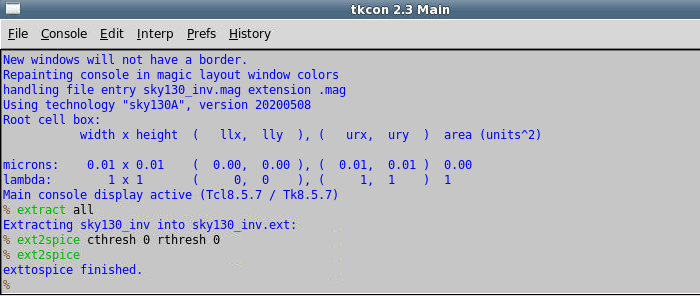
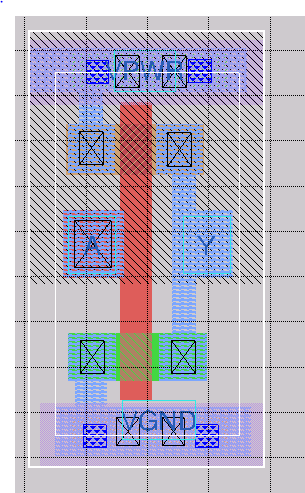
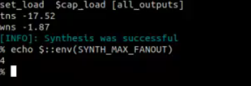
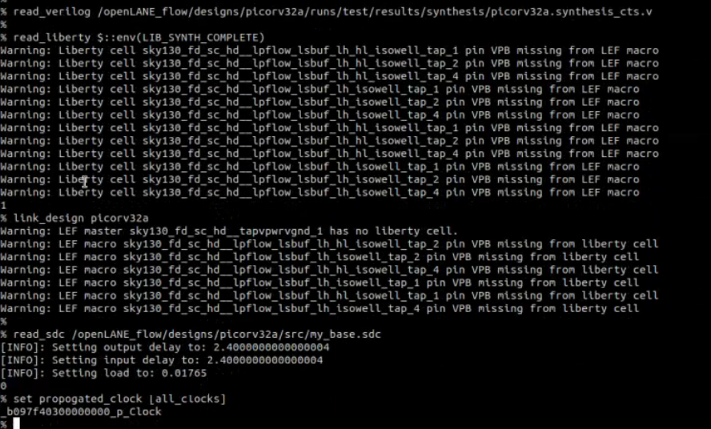

# Advanced Physical Design using OpenLane Sky130 Workshop

# Introduction
This workshop is about complete RTL to GDSII flow of picorv32a design using open source tools provided by OpenLane and Sky130A PDK.  Following are the main objectives of this workshop:
-	Basic inception of PDKs, libraries and openlane simulation flow
-	Incorporation of custom cell in library using ngspice and magic
-	Resolving design rules violation during layout
-	Design improvement by analyzing reports generated and controlling design parameters at each stage 
-	Preforming post synthesis, pre layout and post layout timing analysis 

# DAY1
Day 1 gives introduction to basic terminologies used in VLSI design, introduction to openlane, RISCV and Sky130 PDK.
## Basic Terminologies
### Core and Die
A core is an area in the chip where all the circuit resides. It encapsulates all the combinational circuit, soft and hard IPs, and nets. Die is an area of chip that encapsulates the core and IO pads. 
### IO Pads 
Io pads are the pins that act as the source of communication between core and the outside world. Their placement is crucial in circuit designing as they should be placed close to the circuit to which they communicate to avoid unnecessary delays, extra wire length and voltage drops. 
### RISCV ISA
An Instruction set architecture converts any programming language into hardware understandable language. RiscV provides an open source instruction set architecture. These instructions are then translated into 1s and 0s. Hardware should be designed such that it can perform the required operation as given by the instructions.
### OpenLane and Sky130
OpenLane encapsulates open source EDA tools, libraries, PDKs and designs that are required to generate GDSII of any given RTL design.  PDK is based on 130nm openpdk provided by Skywater. Following diagram gives insight to openLane flow mentioning tools required at each step.

## Lab 1
### OpenLane setup
To setup openlane, first we need to clone the repository from github. Once the setup is done we may invoke the tools either interactively of automatically. To work in interactive mode, type the following command in the terminal:
```sh
./flow.tcl  -interactive  
```
This will open interactive shell like this:


Now we need to check whether required open lane package is installed by using
```sh
package require openlane 0.9
```
Next step is to prepare the design. All the designs reside in the design folder. We may use any design of our choice. This workshop focuses on picorv32a design. 
```sh
prepare -design picorv32a
```

Once preparation is complete, first step is to synthesize the design. Openlane performs this step using yosys and also performs post synthesis timing analysis while applying DRC checks specified by the designer in .sdc file using OpenSTA. To run synthesis, use the following command:
```sh
run_synthesis
```
Here is the netlist created after synthesis. It shows total no. of cells, wires, gates, flops, chip area etc. of the design. 


Once synthesis is completed, timing reports indicate whether timing constraints have been met or not. In our case slack is positive and is met:


# Day 2
Day 2 gave insight to floor planning, its related terms and  how to control configuration parameters.
## Basic terminologies
### Aspect Ratio
It is the ratio of width to height of cell. The width and g=height of vell are measured in microns where 1µm=1000DB (data base units). Aspect ratio of 1 means the chip is of  square shape. Aspect ratio other than 1 indicates rectangular shape chip.
### Utilization and utilization factor
Utilization defines how much area of the chip is occupied by the netlist. Normally the utilization is kept between 30 to 40% of total chip area to keep space for routing and clock tree buffers. Utilization factor is given as:
Utilization factor = Area occupied by netlist/Total chip area


### Floor planning
Floor panning is the step where we decide:
-	Arrangement of pre placed cells and macros in the chip
-	Location of IO pads
-	No. of power pads
-	Power distribution network

The main objectives of floor planning are to minimize:
- Chip area
-	Delay
-	Routing congestion

Floor planning requires following parameters:
-	Netlist
-	Area requirements
-	Power requirements
-	Timing constraints
-	Physical partitioning
-	I/O and macro placement (optional)

At the end of floor planning step we get:
-	Die/block area
-	IO pins placed
-	Macros placed
-	Power grid designed
-	Standard cell placement areas

### Pre placed cells
Pre placed cells are the cells whose location is fixed on a chip and they cannot be moved around during placement. The floor planning tools decide the placement of standard cells keeping in consideration placement of macros. Macros can be used several times in a design. Typical examples of macros are memory blocks, clock gating cells, comparators etc.
### Decoupling capacitors
Decoupling capacitors are used in the design to compensate the voltage drop of long wires and nets as considerable voltage drop may cause the circuit to function abnormally. Macros in the chip are always surrounded by decoupling capacitors commonly referred to as decap cells. 
### Power planning
Power planning ensures continuous voltage and ground supply to all the cells in the circuit thus preventing voltage bounce and voltage droops. During floor planning, a grid of multiple Vdd and GND rails is laid down and each cell is given power from specific rail.


## Lab 2
Lab 2 is about floor planning of the design synthesized in lab 1. We may control different parameters available in the file:
```sh
/openaneflow/configuration/Readme.md
```
To configure a certain parameter, type the following in command window:
```sh
set $env(parameter name) value
```
This will overwrite the value of that certain parameter already configured in either skr130 config file or design’s own config file. Fig below shows some of the configuration parmeters.


Tools available in openlane for floor planning are ioplacer, pdn and trapcell. To run floorplanning type the following command after design synthesis:
```sh
run_floorplan
```


Once floorplanning is completed, we may use magic tool to analyze the plan. To invoke magic following command is used:
```sh 
magic -T <path to .tech file> read lef <path to .lef file> read def <path to .def file>
```
Below diagrams show the layout obtained after floorplanning. 


Zoomed in version of layout shows decap cells and pins orientation. On selecting a particular pin and typing 'what' in the tkcon window we may get info of that part of laout such as metal layer.


To run placement type the following command 
```sh
run_placement
```

The figure below shows results after placement 


# Day 3
Day 3 is about cell design and characterization flow and how a cell is fabricated. We designed a custom cell (a CMOS inverter), extracted its spice netlist and calculated its timing characteristics.
## Cell design Flow
### Required inputs
To make a custom cell, we should have PDKs, DRC rules, LVS models, spice models, library and user defined specs. User defined specs include parameters such as cell height, width, voltage, noise to margin ratio, metal layers, gate length etc. It is the responsibility of library developer to fulfill these specs.
### Design steps
Once the specs are finalized, first step is to design the circuit on transistor level. After it, its layout is  designed making sure that its satisfies all design rules  and then its characterization is done.
### Generated outputs
-	Lef
-	GDSII
-	Timing, noise, power libs

## Lab 3
In lab 3 we created layout of CMOS inverter in magic and then created its ngspice file.


Type the following commands in tkcon window to extract ngspice file.



Once we have created ngspice file, we gave gate, drain and gnd voltage and connected them to appropriate positions in .spice file. Type the following command to invoke ngspice:
```sh
ngspice <.spice file name>
```


Next step is to see voltage variation with respect to time. To open plot type:
```sh
plot y vs time a
```


Now we can calculate different characteristics such as I/O rise/fall transition time. To calculate rise time click on the point over the plot where voltage is 20 % of supply voltage and then click on the point where it is 80% of supply voltage. the difference between these two times is the output rise transition time which is 0.06 in our case. 


# Day 4
In day 4, we extracted lef file for our custom cell and included the cell in merged.lef file. We also performed cts analysis and STA with ideal and real clocks.

There are certain guidlines that must be followed while designing a standard cell:
- IO ports must lie on intersection of tracks
- Width of standard cell must be odd multiple of horizontal track pitch
- Height of standard cell must be odd multiple of vertical track pitch

To observe whether our design fulfills these guidlines open grid on magic by assigning parameters from track.info file as shown below


This will create grid as shown in figure below. The diagram shows that our standard cell width satisfies required guidlines:




To make lef file, tyoe following in tkcon window
```sh 
write lef
```
This will make a lef file with the same name as file name. Now we need to add one command in the design's config file:
```sh
 set ::env(EXTRA_LEFS) [glob $::env(OPENLANE_ROOT)/designs/$::env(DESIGN_NAME)/src/*.lef]
 ```
 We also need to include libraries with our own cell in the design config file as shown below 
 
 
Run the design again from start so that it may take our designed cell during synthesis. To include lef file in the flow run following two commands after design prep.
 ```sh
  set lefs [glob $::env(DESIGN_DIR)/src/*.lef]
  add_lefs -src $lefs
  ```
Now synthesize the design again and see if our custom cell is included in the netlist or not. The below diagram shows that there are 2201 instances of our cell but timing analysis shows that slack has been violated. 
  
  
 
  
  
To confirm wheteher our cell has been placed in the core or not, run placement and check for sky130_vsdinv cell in the layout in magic. Use 'expand' command to see the internal layout of cell.


### Post Synthesis STA
  
Next step is to minimize slack. For this we switched synth_strategy from 2 to 1 to optimize the circuirt such that it meets timing requirements instead of area. Also synth_sizing was set to 1. This reduced the slack to -2.65ns. 
  
  
  
  
  
  
  
Now to see timing reports in STA first create sdc file and set the parameters as required. Now link this sdc file to sta.cong file as shown below:
 
 
 
 
 
Looking into the timing report generated by STA, we found that some of the cells had very high fanout which increases net capacitance and hence output transition time. We can replace such cells by restricting the synthesizer to include cells with maximum fanout of 4. This improved the slavk ti -1.87ns. This can be done with the command shown below:



Now, the figure below shows that some of the buffers have comparetively high transition time as compared to others. We can replace such cells with some other buffer.


This improved the slack from -1.87 to -1.26 as shown below


Now we can replace our updated netlist with netlist already present in the results folder. 


  
  
## CTS
Clock tree synthesis is done to ensure all flops get the clock at the same time. For this purpose repeaters are added in the clock path at suitable locations. In Openlane CTS is done through Triton CTS. To run CTS type the following command in interactive shell.
```sh
run_cts
```


### Post CTS STA
Now invoke open road for timing analysis. We need to read lef and def files and then generate db. 


Now read db, verilog netlist and sdc files as follows



Use the following command to to generate timing report 
```sh
report_check -path -delay min_max -fields {slew trans net cap input_pin}
```


To explore further, remove the clkbuf1 from the buffers list, run cts and then generate reports:


# Day 5
Day 5 was about power distribution network, global and detailed routing, post routing timing analysis and routing algorithms.

## Routing
Routing is the process of connecting cells by actual nets while taking care of design rule such as wire width, wire spacing, wire pitch. Openlane uses Triton Route
to perform routing.

## Lab 5

### PDN generation
In the next step, we created power distribution network using following command
```sh 
gen_pdn
```


### Routing
Next step is to route all the nets. Following command is used for routing
```sh
run_routing
```
The routing results are shown as follows:


In the final step we generated SPEF file. Spec extractor is not part of openlane flow. The diagram below shows final layout of the chip in KLayout


Below diagrams show GDS layout of chip.


# ACKNOWLEDGEMENTS

- Kunal Ghosh, Co-Founder (VSD Corp. Pvt. Ltd)
- Nickson P Jose, Teaching Assistant (VSD Corp. Pvt. Ltd)


